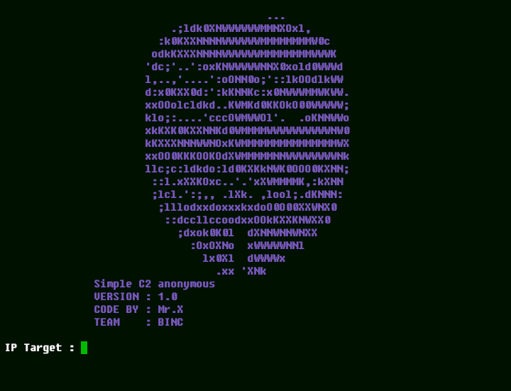

# anonymous-c2

## introduction
This is a DDOS tool {denial-of-service} by sending commands to botnet members. Botnet members can be called zombies and the botnet itself can be called a zombie army.

## Instalations

    
<strong>How To Install:</strong>

    WATCH THIS !! 
    -The Best Option- 
    Byte Per Sec : 250 - 410 = Req : 55k [Verified] 
    Thread : 250 - 420 = Req : 50k+ [Verified] 
    
    -= Termux =-

    1. pkg update && pkg upgrade
    2. pkg install curl
    3. pkg install python3
    4. pkg install git
    5. git clone https://github.com/Whomrx666/anonymous-c2
    6. cd anonymous-c2
    7. pip install -r requirements.txt
    8. python3 anonymous-c2.py

    -= Ubuntu =-

    1. sudo apt-get update && sudo apt-get updgrade
    2. sudo apt install python3
    3. sudo apt install python3-pip
    4. sudo apt install curl
    5. sudo apt install git
    6. git clone https://github.com/Whomrx666/anonymous-c2
    7. cd anonymous-c2
    8. pip3 install -r requirements.txt
    9. python3 anonymous-c2.py

    -= Kali Linux =-

    1. apt update && apt upgrade
    2. apt install curl
    3. apt install python3
    4. apt install python3-pip
    5. apt install git
    6. git clone https://github.com/Whomrx666/anonymous-c2
    7. cd anonymous-c2
    8. pip3 install -r requirements.txt
    9. python3 anonymous-c2.py

    -= Linux Mint =-

    Same as like kali linux

## Instructions
- **Ip target**: By entering the victim's target IP, you will be able to run a zombie botnet army to attack the victim
- **Port**: A port is a mechanism on a computer to connect with programs and other computers on the network
- **BPS**: Bytes is a term commonly used as a unit of data storage in computers
- **Thrds**: thrs is a measure of bytes
- **Boost**: bost is the impetus that is on this tool
- **bot**: an army of botnets that will run ddos

## Warning
Write using letters accompanied by numbers instead of using numbers, for example HTTP

### Original Author

Follow me: [Whatsapp](https://wa.me/6287855190571),[Youtube](https://youtube.com/@whomrx666),[Tiktok](https://www.tiktok.com/@whomr.x),[Telegram](https://www.tiktok.com/@whomr.x),[Telegram](https://t.me/@Whomr_X),&[Website](https://whomrxhackers.blogspot.com/)
